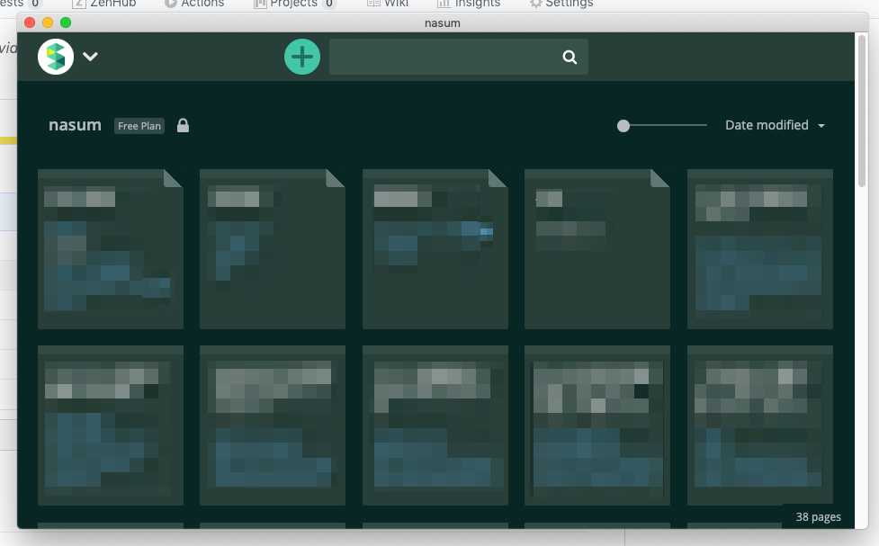

# web_to_desktop

This command display the target Web page in a new Window.



## What is this?

This command line tool can make desktop application of web page. Using Chrome.

I wanted a desktop app for web applications not being PWA.

## Usage

Install and setup.

```bash
npm install
npm link
```

Use in terminal.

```bash
web_to_desktop target_web_url
web_to_desktop -d target_web_url # daemonize
```

open window and show website.